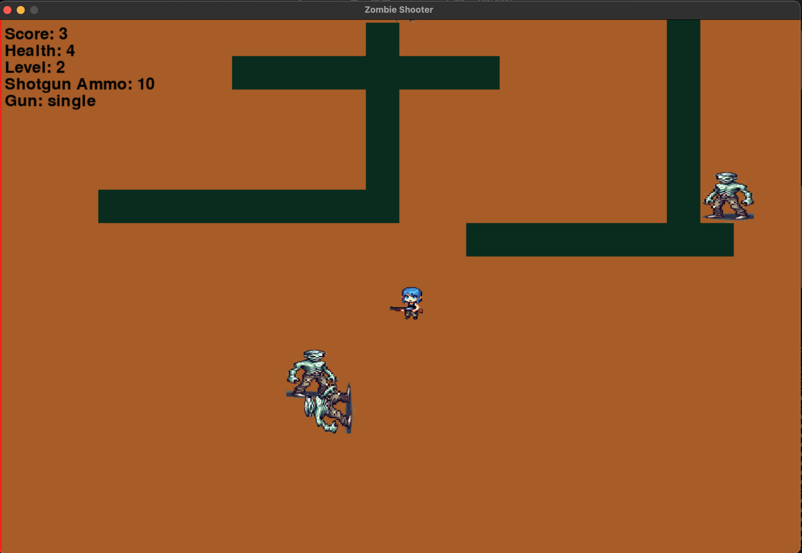

# Zombie Shooter



A top-down zombie survival game built with Python and Pygame.
Move through three levels, avoid getting surrounded, and clear each level's kill goal to win.

## What is in this game

- 3 levels with different wall layouts and increasing zombie pressure
- Two weapon modes:
  - `single` shot (default, unlimited)
  - `shotgun` spread fire (limited ammo)
- Pickups:
  - Treasure chest gives +5 shotgun ammo (max 20)
  - Heart drops restore health
- Score, health, level, and ammo HUD
- Sound effects + background music

## Install

### 1) Clone

```bash
git clone https://github.com/ajay-vikram/Zombie-Shooter.git
cd Zombie-Shooter
```

### 2) Create and activate a virtual environment

```bash
python3 -m venv .venv
source .venv/bin/activate
```

### 3) Install dependencies

Quick game-only install:

```bash
pip install pygame
```

Full project dependencies:

```bash
pip install -r requirements.txt
```

## Run

```bash
python3 main.py
```

## Controls

- `W A S D`: Move
- `Space`: Fire current weapon
- `Tab`: Switch between single and shotgun
- `Esc`: Pause / resume
- `Window Close (X)`: Quit

## How progression works

- Start at Level 1
- Kill goals:
  - Level 1: `5` kills
  - Level 2: `15` kills
  - Level 3: `30` kills
- Reaching the Level 3 goal ends the game with a win screen
- If health reaches `0`, game over

## Notes

- If sound is too loud or you want silent mode, change `sound=True` to `sound=False` in `main.py`.
